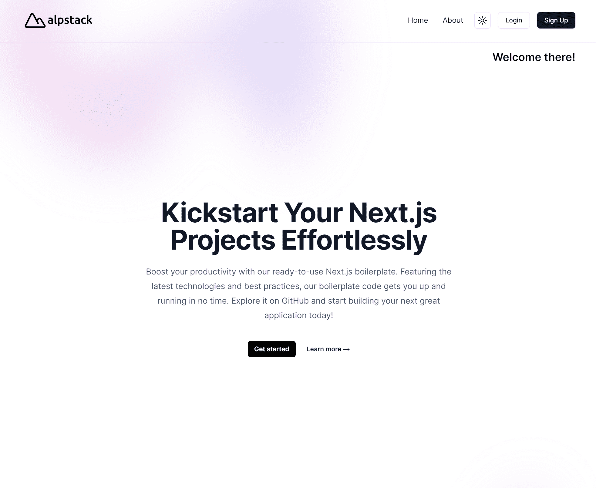
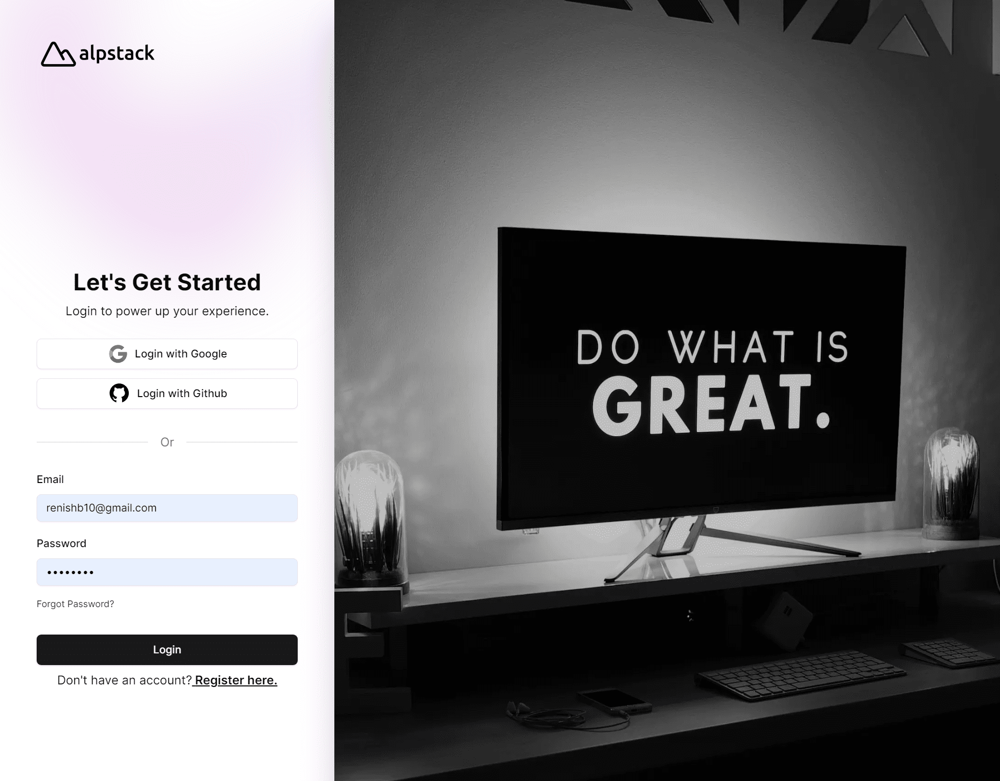
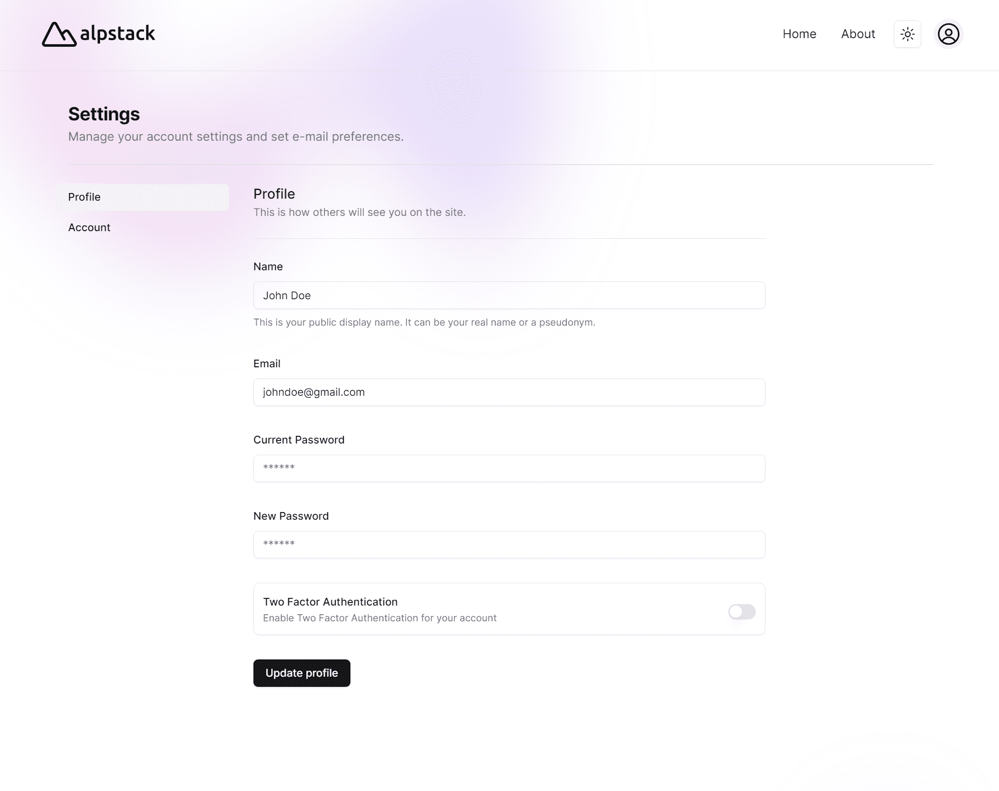

# Next.js Auth.js Postgres Starter Code

Welcome to the Next.js Auth.js Postgres Starter Code repository! This project is designed to help developers kickstart their Next.js projects with a robust and modern tech stack, allowing them to focus on business logic and application development.



## Features

- **Next.js 14**: Leverage the latest version of Next.js with advanced features and optimizations.
- **App Router**: Simplified routing with the new App Router feature.
- **Postgres**: A powerful and flexible relational database.
- **Prisma**: A modern ORM to interact with your database.
- **Auth.js (Next.js V5 beta)**: Secure authentication with Email, Google, and GitHub providers.
- **Two-Factor Authentication**: Users can opt for additional security from their settings page.
- **Resend**: Integrated email service provider.
- **TailwindCSS**: Utility-first CSS framework for rapid UI development.
- **ShadCn UI**: Pre-built UI components with New York theme and dark mode support.
- **React Hook Form & Zod**: Efficient form handling and validation.

## Authentication Providers

Implemented authentication providers:

- Email
- Google
- GitHub

Login Page


Settings Page


The code is modular, making it easy to add or remove other providers. For more information, visit [Auth.js Providers](https://authjs.dev/getting-started#official-providers).

## Database Configuration

We use Postgres with Prisma ORM. You can opt for custom Postgres DB hosting or services like Supabase, Neon, etc. For more information, visit [Prisma Quickstart](https://www.prisma.io/docs/getting-started/quickstart).

The Prisma adapter for Auth.js is used. For more information, visit [Prisma Adapter](https://authjs.dev/getting-started/adapters/prisma).

## UI Configuration

TailwindCSS and ShadCn UI components are used, with ShadCn's New York theme and dark mode support. Forms utilize React Hook Form and Zod for validations.

## Routing Configuration

By default, new pages are private. Configure routes in `/src/routes.ts`:

```typescript
export const publicRoutes = ['/', '/about', '/contact', '/error', '/goodbye'];

export const authRoutes = [
  '/login',
  '/signup',
  '/auth/verify-email',
  '/auth/new-password',
  '/auth/reset-password',
];
```

## Custom Hooks for Authentication

To get the auth session from the client side, use `useCurrentUser` and `useCurrentRole` custom hooks:

```typescript
const user = useCurrentUser();
const role = useCurrentRole();
```

For server-side auth session, use `currentUser` and `currentRole` from `@/lib/auth`.

## Local Setup Instructions

1. Rename `.env.example` to `.env` and add/replace relevant values for required keys:

   ```plaintext
   AUTH_SECRET=
   DATABASE_URL=
   GITHUB_CLIENT_ID=
   GITHUB_CLIENT_SECRET=
   GOOGLE_CLIENT_ID=
   GOOGLE_CLIENT_SECRET=
   RESEND_API_KEY=
   NEXT_PUBLIC_APP_URL="http://localhost:3000"
   ```

   - **AUTH_SECRET**: Generate with `openssl rand -base64 32` or [generate-secret.vercel.app](https://generate-secret.vercel.app/32)
   - **DATABASE_URL**: Your Postgres DB connection string
   - **GITHUB_CLIENT_ID** and **GITHUB_CLIENT_SECRET**: Follow [GitHub OAuth App Guide](https://docs.github.com/en/apps/oauth-apps/building-oauth-apps/creating-an-oauth-app)
   - **GOOGLE_CLIENT_ID** and **GOOGLE_CLIENT_SECRET**: Follow [Google Client ID Guide](https://www.balbooa.com/help/gridbox-documentation/integrations/other/google-client-id)
   - **RESEND_API_KEY**: Get from [Resend](https://resend.com/api-keys)

2. Install dependencies:

   ```bash
   npm install
   ```

3. Apply schema changes to your database:

   ```bash
   npx prisma generate
   npx prisma migrate dev
   ```

4. Run Prisma Studio:

   ```bash
   npx prisma studio
   ```

5. Start the application:

   ```bash
   npm run dev
   ```

6. To push schema changes directly to the production database:

   ```bash
   npx prisma db push
   ```

7. Format schema code:
   ```bash
   npx prisma format
   ```

For more Prisma-related commands, check their [official documentation](https://www.prisma.io/docs).

## Developer

This starter code was developed by [Renish B](https://renish.me/).

Happy coding!
